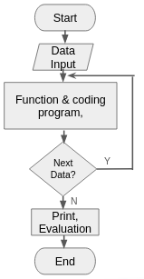
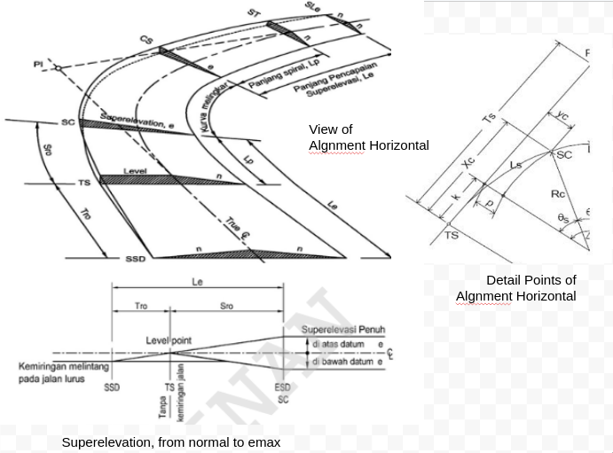
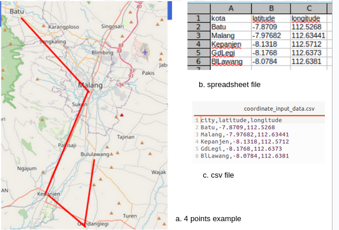
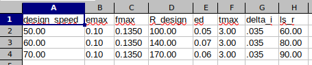
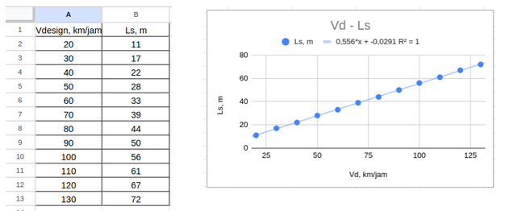
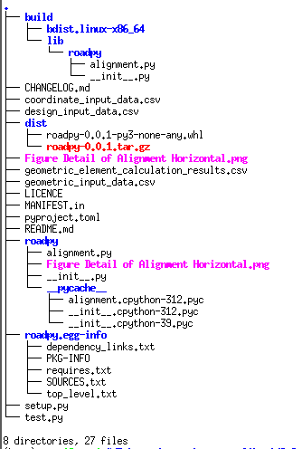
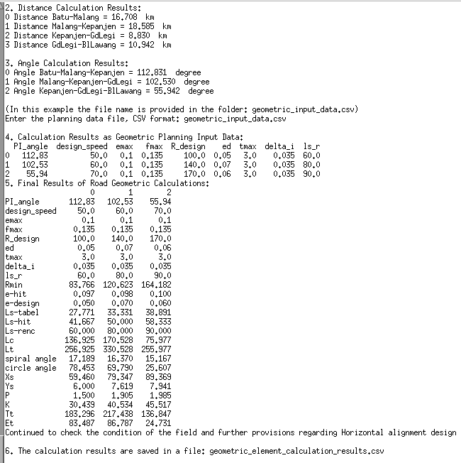
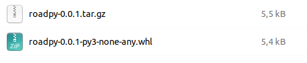

### README
# 1. Introduction
Road geometric planning is a Compulsory Course in Civil Engineering. Good corner geometry will provide a safe and comfortable speed for the driver through the bend.
Calculations require accuracy considering the many planning factors and geometric calculations. Guidelines or manuals generally use the Highway Design Manual, 2020. Afolayan et al (2020), have compiled quite well how to plan geometrically. More detailed guidelines were issued by the Ministry of PUPR of the Republic of Indonesia, Directorate General of Highways via SE. Number 20/SE/Db/2021 concerning Road Geometric Design Guidelines.
There are quite a lot of geometric calculations using programming. Aditya Danuka et al (2023) developed the Web Application Tool for Highway Design (WAT-HD). Meanwhile Autodesk (2023) developed quite good 3D road planning.
ROADPY was developed in Python, the output points and geometric elements can be used as a more comprehensive evaluation of advanced planning
# 2. Flow Chart
Roadpy was developed with the following steps:



Figure 1. Roadpy Development Flowchart

# 3. Review of Horizontal Alignment Design
## a. Elements of Alignment Horizontal
1. Point of Intersection,
2. Design Speed, Vd
3. Normal superelevation (en), superelevation design (ed),
4. Point TS (Tangent to Spiral), SC (Spiral to Circle), CS (Circle to Spiral), ST (Spiral to Tangent)
5. The curved length of superelevation attainment: Le atau Ls
6. Angle of Spiral, Angle of Circle
7. Xc, Yc, k, P, 
8. Total length of Tangent (TT), length from PI to Circle (ET);


Draw horizontal alignment elements as shown in the following image:



Figure 2. Elements of Alignment Horizontal,
(cited from: SE Dirjen Bina Marga Nomor 20/SE/Db/2021, p:100)

## b. Calculation of Horizontal Alignment elements:
1. fmax = 0.192 - 0.00065*Vd, for Vd < 80 km/jam,

   fmax = 0.24 - 0.00125*Vd
3. Rmin = Vr2 / (127*emax + fmax)
4. Dmax = 181913.52*(emax+fmax)/(Vd2)
Dd = 1432.39/R
5. e_hit = (((-emax*Dd2)/(Dmax2))+((2*b*Dd)/(Dmax)))
6. Ls_hitung:
 
   - Lst = (Vr/3.6)*T
   - Lmodified Shortt, Ls = (((0.0214*Vr3)/(R*1.2)))
   - Lsi = (emax - en)Vr/(3.6*re, rate of change of superelevation attainment, re=0.035 (Vr<80) atau 0,025 (Vr>80)
   - from 1,2,3 take the longest Ls
7. Ls_tabel=0.556*Vd-0.029  
 (from, tabel AASHTO, 2011, SE 20/2021 hal 125)
8. Angle_spiral = (90*Ls/(p*R))
9. Angle_circle = sudut PI -(2*angleSpiral)
10. Lc = (angleCircle*pi*Rd)/180
11. Xs = Ls*(1-((Ls2)/(40*Rd2)))
12. Ys = (Ls2)/(6*Rd)
13. P = Ls2/(24*Rd)
14. K = Ls-(Ls2/(40*(Rd2)))-Rd*sin(angleSpiral*pi/180)
15. Tt = (Rd+P)*tan(0.5*angle_PI*pi/180)+K
16. Et = ((Rd+P)/(cos(0.5*angle_PI*pi/180)))-Rd
17. Lt = calc_Lc+2*Ls
18. Angle between two vector: angle(u,v)
    - angle = math.acos(np.dot(u,v)/ (np.linalg.norm(u)*np.linalg.norm(v))))
   
# 4. Data Input
## a. Topography, 
The map  from openstreet, select the road route whose alignment will be designed with several curve plan points (PI, Point of Intersection). The roadpy test simulation using topographic data for the cities of Batu-Kota - Malang - Kepanjen City - Gondanglegi and Bululawang obtained 4 points or 3 corners of the highway. The map and latitude-longitude data are as shown in the image below:



Figure 3 Road Map and Latitude-Longitude Table

Coordinate data is stored in a csv file: 
``` python
coordinate_input_data.csv
```

## b. Road Geometric Design Data
1. Design speed, Vd, 
2. Maximum superelevation, emax
3. Wheel tire friction against asphalt, fmax
4. The radius of the design bend circle, Rdesign,
5. T, Transition curve travel time, tmax=3,00”
6. The rate of change in slope, delta_i or  re-max:
VR <80 Km/jam, re-max = 0,035 m/m/detik
VR ≥ 80 Km/jam, re-max = 0,025 m/m/detik
7. Curvature length of spiral transition to superelevation, Le or Ls Design data as in the following table:


Table 1 Design Input Data



Figure 4. Vd - Ls relationship and its equations
(ref: SE Dirjen Bina Marga Nomor 20/SE/Db/2021, page:125, AASHTO, 2011)

# 5. Create Functions
## 1. Package Import

Install the following python package in your cmd and import in your coding:
```python
pip install math
pip install pandas
pip install haversine 
pip install numpy 
pip install matplotlib

and import
import math
import pandas as pd
import haversine as hs
import numpy as np
import matplotlib.image as mpimg
import matplotlib.pyplot as plt
```
## 2. Variables:
 - a = Design Speed (Kph) 
 - b = emax  
 - c = fmax 
 - d = R design (m)     
 - e = T, Transition curve travel time, tmax=3,00”
 - Dd =
 - ed =
 - f = delta_i, The rate of change in slope: 0.035 (Vr<80) atau 0,025 (Vr>80), (ref SE Dirjen Bina Marga Nomor 20/SE/Db/2021, page:100)
 - g = Angle PI, derajat
 - Ls = Length of spiral design
 - Angle Spiral
 - Angle Circle
 - P =
 - K =
 - Lc = Length of circle
 - u, v = the angle of vectors u, v

## 3. Functions
```python
def hitungFmax(a):
    return (0.192-(0.00065*(a)))

def hitungRmin(a,b,c):
    return (a**2)/(127*(b+c))

def hitungDmax(a,b,c):
    return ((181913.53*(b+c))/(a**2))

def hitungDd(d):
    return 1432.4/(d)

def e_Hitung_def(b, Dd, Dmax):
    return (((-b*Dd**2)/(Dmax**2))+((2*b*Dd)/(Dmax)))

def hitung_Lst(a,e):
    return (a/3.6)*e

def hitung_Lsms(a,d):   # modifikasi shortt: return (((0.022*a**3)/(d*0.4))-(2.727*(a*ed)/0.4))
    return (((0.0214*a**3)/(d*1.2)))  # C=1,2, ref: SE 20/2021 hal 125

def hitung_Lsi(a,f):       # Diantara 2 Ls, diambil yang terpanjang
    return (0.1-0.02)*a/(3.6*f)

def sudutSpiral_def(d, Ls):
    return (90*Ls/((math.pi)*d))

def sudutCircle(g, sudutSpiral_def):
    return (g-(2*(sudutSpiral_def)))

def hitung_Lc(sudutCircle, d):
    return (sudutCircle*math.pi*d)/180

def hitung_Xs(Ls, d):
    return Ls*(1-((Ls**2)/(40*d**2)))

def hitung_Ys(Ls, d):
    return (Ls**2)/(6*d)

def hitung_P(Ls,d):
    return Ls**2/(24*d)

def hitung_K(Ls, d, sudutSpiral):
    return Ls-(Ls**2/(40*(d**2)))-d*math.sin(sudutSpiral*math.pi/180)

def hitung_Tt(d, P, g, K):
    return (d+P)*math.tan(0.5*g*math.pi/180)+K

def hitung_Et(d, hitung_P, g):
    return ((d+hitung_P)/(math.cos(0.5*g*math.pi/180)))-d

def hitung_Lt(hitung_Lc, Ls):
    return hitung_Lc+2*Ls

def angle(u, v):
    """return the angle between two vectors in any dimension space, indegrees"""
    return np.degrees(
        math.acos(np.dot(u,v)/ (np.linalg.norm(u)*np.linalg.norm(v))))
    #Ref:angle between three point, iTechNote, https://itecnote.com/tecnote/python-code-to-calculate-angle-between-three-points-lat-long-coordinates/

```
## 4. Python Coding
The main programs as in the file: 
```
alignment.py
```

# 6. Folder and filling
Folder and filling structure as shown below:



Figure 5. Folder Structure and Filling.

# 7. Output
Output, running test.py at the console prompt:
```
  - $python test.py
```
you will be asked for the input file:
```
coordinate_input_data.csv
```
And
```
geometric_element_calculation_results.csv
```
Make sure you have installed all the necessary import packages.
The output of running the roadpy package (tets.py)  is as shown in Figure 6 below.



Figure 6. Output of running test.py

The output file will be saved in the 
```
geometric_element_calculation_results.csv
```
# 8. Distribution dan Install package
install: 
```python
pip install roadpy
```
or

Download file roadpy-0.0.1.tar.gz
install package: 
```python
$pip install roadpy-0.0.1.tar.gs
```



### references:

1. AASHTO. A Policy on Geometric Design of Highways and Streets. American Association of State Highway and Transportation Officials, Washington D.C, 1984, 2001, 2004, 2005, 2011;
2. Afolayan, Oluwasola, and Abiola, 2020. Reliability Approach to Highway Geometric Design: A Methodical Review. International Conference of Science, Engineering & Environmental Technology (ICONSEET), 4(9): 62-79, 2019, ISSN 0794-9650;
3. Aditya Dhanuka, Aman Srivastava, Leena Khadke, and Nand Lal Kushwaha. 2023. Smart Geometric Design of Highways Using HTML Programming for Sustainable and Climate Resilient Cities;
4. Autodesk. 2023. Civil 3D features for road and highway design, source: https://www.autodesk.com/products/civil-3d/road-design
5. Highway Design Manual. 2020. Chapter 200 – Geometric Design And Structure Standards.
6. Ratna Putri Hidayati, Tugas Akhir T Sipil ITS, 2016 Perencanaan Geometrik Dan Perencanaan Perkerasan Lentur Menggunakan Metode Aashto’93 Pada Jalan Desa Munjungan Ke Desa Karanggandu Kabupaten Trenggalek;
7. SE Dirjen Bina Marga Nomor 20/SE/Db/2021 tentang Pedoman Desain Geometrik Jalan
8. UU No.14 Tahun 1992 Tentang Lalu Lintas dan Angkutan Jalan
9. UU No.38 Tahun 2004 tentang Jalan; dan PP 34/2006 tentang Jalan
10. Coding python, ref: https://www.python.org/ 


