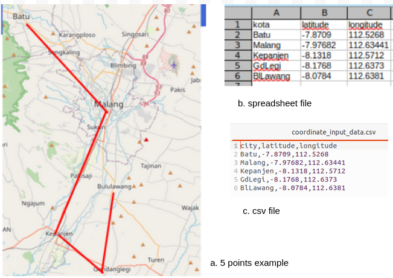

### README
# 1. Introduction
Road geometric planning is a Compulsory Course in Civil Engineering. Good corner geometry will provide a safe and comfortable speed for the driver through the bend.
Calculations require accuracy considering the many planning factors and geometric calculations. Guidelines or manuals generally use the Highway Design Manual, 2020. Afolayan et al (2020), have compiled quite well how to plan geometrically. More detailed guidelines were issued by the Ministry of PUPR of the Republic of Indonesia, Directorate General of Highways via SE. Number 20/SE/Db/2021 concerning Road Geometric Design Guidelines.
There are quite a lot of geometric calculations using programming. Aditya Danuka et al (2023) developed the Web Application Tool for Highway Design (WAT-HD). Meanwhile Autodesk (2023) developed quite good 3D road planning.
ROADPY was developed in Python, the output points and geometric elements can be used as a more comprehensive evaluation of advanced planning
# 2. Flow Chart
Roadpy was developed with the following steps:


Figure 1. Roadpy Development Flowchart

# 3. Review of Horizontal Alignment Design
## a. Elements of Alignment Horizontal
1. Point of Intersection,
2. Design Speed, Vd
3. Normal superelevation (en), superelevation design (ed),
4. Point TS (Tangent to Spiral), SC (Spiral to Circle), CS (Circle to Spiral), ST (Spiral to Tangent)
5. The curved length of superelevation attainment: Le atau Ls
6. Angle of Spiral, Angle of Circle
7. Xc, Yc, k, P, 
8. Total length of Tangent (TT), length from PI to Circle (ET);


Draw horizontal alignment elements as shown in the following image:


Figure 2. Elements of Alignment Horizontal,
(cited from: SE Dirjen Bina Marga Nomor 20/SE/Db/2021, p:100)

## b. Calculation of Horizontal Alignment elements:
1. fmax = 0.192 - 0.00065*Vd, for Vd < 80 km/jam,

   fmax = 0.24 - 0.00125*Vd
3. Rmin = Vr2 / (127*emax + fmax)
4. Dmax = 181913.52*(emax+fmax)/(Vd2)
Dd = 1432.39/R
5. e_hit = (((-emax*Dd2)/(Dmax2))+((2*b*Dd)/(Dmax)))
6. Ls_hitung:
 
   - Lst = (Vr/3.6)*T
   - Lmodified Shortt, Ls = (((0.0214*Vr3)/(R*1.2)))
   - Lsi = (emax - en)Vr/(3.6*re, rate of change of superelevation attainment, re=0.035 (Vr<80) atau 0,025 (Vr>80)
   - from 1,2,3 take the longest Ls
7. Ls_tabel=0.556*Vd-0.029  
 (from, tabel AASHTO, 2011, SE 20/2021 hal 125)
8. Angle_spiral = (90*Ls/(p*R))
9. Angle_circle = sudut PI -(2*angleSpiral)
10. Lc = (angleCircle*pi*Rd)/180
11. Xs = Ls*(1-((Ls2)/(40*Rd2)))
12. Ys = (Ls2)/(6*Rd)
13. P = Ls2/(24*Rd)
14. K = Ls-(Ls2/(40*(Rd2)))-Rd*sin(angleSpiral*pi/180)
15. Tt = (Rd+P)*tan(0.5*angle_PI*pi/180)+K
16. Et = ((Rd+P)/(cos(0.5*angle_PI*pi/180)))-Rd
17. Lt = calc_Lc+2*Ls
18. Angle between two vector: angle(u,v)
    - angle = math.acos(np.dot(u,v)/ (np.linalg.norm(u)*np.linalg.norm(v))))
   
# 4. Data Input
## a. Topography, 
The map  from openstreet, select the road route whose alignment will be designed with several curve plan points (PI, Point of Intersection). The roadpy test simulation using topographic data for the cities of Batu-Kota - Malang - Kepanjen City - Gondanglegi and Bululawang obtained 4 points or 3 corners of the highway. The map and latitude-longitude data are as shown in the image below:



Figure 3 Road Map and Latitude-Longitude Table

This coordinate data is saved as coordinate_input_data.csv later as input when the program is run.
``` python
coordinate_input_data.csv
```
If you want to use other data, use the CSV format as in the example above.

## b. Road Geometric Design Data
1. Design speed, Vd, 
2. Maximum superelevation, emax
3. Wheel tire friction against asphalt, fmax
4. The radius of the design bend circle, Rdesign,
5. T, Transition curve travel time, tmax=3,00”
6. The rate of change in slope, delta_i or  re-max:
VR <80 Km/jam, re-max = 0,035 m/m/detik
VR ≥ 80 Km/jam, re-max = 0,025 m/m/detik
7. Curvature length of spiral transition to superelevation, Le or Ls Design data as in the following table:


Table 1 Design Input Data.

This design data is saved as geometric_input_data.csv later as input when the program is run.
``` python
geometric_input_data.csv
```
If you want to use other data, use the CSV format as in the example above.


Figure 4. Vd - Ls relationship and its equations
(ref: SE Dirjen Bina Marga Nomor 20/SE/Db/2021, page:125, AASHTO, 2011)

# 5. Create Functions
## 1. Package Import

Install the following python package in your cmd and import in your coding:
```python
pip install math
pip install pandas
pip install haversine 
pip install numpy 
pip install matplotlib

and import
import math
import pandas as pd
import haversine as hs
import numpy as np
import matplotlib.image as mpimg
import matplotlib.pyplot as plt
```
## 2. Variables:
 - a = Design Speed (Kph) 
 - b = emax  
 - c = fmax 
 - d = R design (m)     
 - e = T, Transition curve travel time, tmax=3,00”
 - Dd =
 - ed =
 - f = delta_i, The rate of change in slope: 0.035 (Vr<80) atau 0,025 (Vr>80), (ref SE Dirjen Bina Marga Nomor 20/SE/Db/2021, page:100)
 - g = Angle PI, derajat
 - Ls = Length of spiral design
 - Angle Spiral
 - Angle Circle
 - P =
 - K =
 - Lc = Length of circle
 - u, v = the angle of vectors u, v

## 3. Functions
```python
def calculate_fmax(_a):
    """a = Design Speed, Vd(Kph)"""
    return (0.192-(0.00065*(_a)))

def calculate_rmin(_a,_b,_c):
    """b = emax, c = fmax"""
    return (_a**2)/(127*(_b+_c))

def calculate_d_max(_a,_b,_c):
    """a = Design Speed, Vd(Kph),b = emax, c = fmax"""
    return ((181913.53*(_b+_c))/(_a**2))

def calculate_dd(_d):
    """d = R design, Rd (m)"""
    return 1432.4/(_d)

def e_calculate_def(_b, _dd, _d_max):
    """b = emax, Dd, d_max"""
    return (((-_b*_dd**2)/(_d_max**2))+((2*_b*_dd)/(_d_max)))

def calculate_lst(_a,_e):
    """e = T, Transition curve travel time, tmax=3,00” """
    return (_a/3.6)*_e

def calculate_lsms(_a,_d):
    '''modifikasi shortt: return (((0.022*a**3)/(d*0.4))-(2.727*(a*ed)/0.4))
    C=1,2, ref: SE 20/2021 hal 125'''
    return (((0.0214*_a**3)/(_d*1.2)))

def calculate_lsi(_a,_f):
    """a = Design Speed, Vd(Kph)
    f = delta_i, 0.035 (Vr<80) atau 0,025 (Vr>80) """
    return (0.1-0.02)*_a/(3.6*_f)

def angle_spiral_def(_d, _ls):
    """d = R design, Rd (m), Ls"""
    return 90*_ls/((math.pi)*_d)

def angle_circle_def(_g, _h):
    """g = Angle PI, derajat"""
    _h = angle_spiral_def
    return (_g-(2*(_h)))

_i = angle_circle_def
def calculate_lc(_i, _d):
    """d = R design, Rd (m)"""
    return (_i)*(math.pi*(_d)/180)

def calculate_xs(_ls, _d):
    """d = R design, Rd (m)"""
    return _ls*(1-((_ls**2)/(40*_d**2)))

def calculate_ys(_ls, _d):
    """d = R design, Rd (m)"""
    return (_ls**2)/(6*_d)

def calculate_p(_ls,_d):
    """d = R design, Rd (m)"""
    return _ls**2/(24*_d)

def calculate_k(_ls, _d, _angle_spiral):
    """d = R design, Rd (m)"""
    return _ls-(_ls**2/(40*(_d**2)))-_d*math.sin(_angle_spiral*math.pi/180)

def calculate_tt(_d, _p, _g, _k):
    """d = R design, Rd (m)"""
    return (_d+_p)*math.tan(0.5*_g*math.pi/180)+_k

_j = calculate_p
def calculate_et(_d, _j, _g):
    """d = R design, Rd (m)"""
    return ((_d+_j)/(math.cos(0.5*_g*math.pi/180)))-_d

_k = calculate_lc
def calculate_lt(_k, _ls):
    """ls = length of spiral)"""
    return _k+2*_ls

def angle(_u, _v):
    """return the angle between two vectors in any dimension space, indegrees
    Ref:angle between three point, iTechNote,"""
    return np.degrees(
        math.acos(np.dot(_u,_v)/(np.linalg.norm(_u)*np.linalg.norm(_v))))

def distance(coordinate):
    """Calculate distances and angles between 3 or more points
        input file longitude latitude data coordinate_input_data.csv as coordinate
    """
    output=[]
    for i in range(len(coordinate)-1):
        loc1=(coordinate.iloc[i,1], coordinate.iloc[i,2])
        loc2=(coordinate.iloc[i+1,1], coordinate.iloc[i+1,2])
        a=hs.haversine(loc1,loc2)
        #b='{:.3f}'.format(a)
        #output.append(b)
        df=pd.DataFrame(output, columns=(['distance, km']))
        print(i, 'Distance ' +coordinate.iloc[i,0]+ '-' +coordinate.iloc[i+1,0]+ ' = {:.3f}'.format(a),  ' km')
    #data1=coordinate.assign(distance=df)
    return 
    
def angles(coordinate):
    """Calculate Angles (Point of Intersection, PI)"""
    output=[]
    for i in range(len(coordinate)-2):
        loc1=(coordinate.iloc[i,1], coordinate.iloc[i,2])
        loc2=(coordinate.iloc[i+1,1], coordinate.iloc[i+1,2])
        loc3=(coordinate.iloc[i+2,1], coordinate.iloc[i+2,2])
        a=np.radians(np.array(loc1))
        b=np.radians(np.array(loc2))
        c=np.radians(np.array(loc3))
        avec=a-b
        cvec=c-b
        lat = b[0]
        avec[1] *= math.cos(lat)
        cvec[1] *= math.cos(lat)
        PI_angle = angle(avec, cvec)
        c=f"{(PI_angle):0.3f}"
        output.append(c)
        df1=pd.DataFrame(output, columns=(['PI_angle(degree)']))
        print(i,'Angle '+coordinate.iloc[i,0]+'-'
               +coordinate.iloc[i+1,0]+'-'+coordinate.iloc[i+2,0]
               + ' = {:.3f}'.format(PI_angle), ' degree')
    data2=coordinate.assign(PI_angle=df1)
    #data3=(data2.iloc[0:3,4])
    df1=pd.DataFrame(data2)
    return df1
    
def Horizontal(df):
    """Calculating the geometric elements (alignment) of the highway
        using above functions, file input geometric_input_data.csv join angles, as df
    """
    output=[]
    for i in range(len(df)):
        Rmin=calculate_rmin(df.iloc[i,1],df.iloc[i,2],df.iloc[i,3]) # (Vd,emax,fmax )
        d_max=calculate_d_max(df.iloc[i,1],df.iloc[i,2],df.iloc[i,3])
        Dd=calculate_dd(df.iloc[i,4])
        e_calculate=e_calculate_def(df.iloc[i,2], Dd, d_max)
        lst=calculate_lst(df.iloc[i,1],df.iloc[i,6])
        lsms=calculate_lsms(df.iloc[i,1],df.iloc[i,4])
        lsi=calculate_lsi(df.iloc[i,1],df.iloc[i,7])
        L=(lst,lsms,lsi)
        lsort=sorted(L)
        Ls_calculate=lsort[2]
        Ls_tabel=0.556*df.iloc[i,1]-0.029
        angle_spiral=angle_spiral_def(df.iloc[i,4],df.iloc[i,8])
        j=pd.to_numeric(df.iloc[i,0])
        angle_circle=(j)-2*angle_spiral
        Lc=calculate_lc(angle_circle, df.iloc[i,4])
        Xs=calculate_xs(df.iloc[i,8], df.iloc[i,4])
        Ys=calculate_ys(df.iloc[i,8], df.iloc[i,4])
        P=calculate_p(df.iloc[i,8],df.iloc[i,4])
        K=calculate_k(df.iloc[i,8], df.iloc[i,4], angle_spiral)
        Tt=calculate_tt(float(df.iloc[i,4]), P, float(df.iloc[i,0]), K)
        Et=calculate_et(float(df.iloc[i,4]), P, float(df.iloc[i,0]))
        Lt=calculate_lt(Lc, df.iloc[i,8])
        a=('{:,.3f}'.format(Rmin))
        b=('{:,.3f}'.format(df.iloc[i,4])) 
        c=('{:,.3f}'.format(e_calculate))
        d=('{:,.3f}'.format(df.iloc[i,5])) 
        e=('{:,.3f}'.format(Ls_tabel))
        f=('{:,.3f}'.format(Ls_calculate))
        g=('{:,.3f}'.format(df.iloc[i,8])) 
        h=('{:,.3f}'.format(Lc))           
        i=('{:,.3f}'.format(Lt))           
        j=('{:,.3f}'.format(angle_spiral))
        k=('{:,.3f}'.format(angle_circle))
        l=('{:,.3f}'.format(Xs))
        m=('{:,.3f}'.format(Ys))
        n=('{:,.3f}'.format(P))
        o=('{:,.3f}'.format(K))
        p=('{:,.3f}'.format(Tt))
        q=('{:,.3f}'.format(Et))
        output.append((a,c,d,e,f,g,h,i,j,k,l,m,n,o,p,q))
        df1 = (pd.DataFrame(output, columns=(['Rmin, m', 'e-hit',
                                              'e-design','ls-tabel, m','ls-hit, m',
                                              'ls-renc, m','Lc, m','Lt, m',
                                              'spiral angle','circle angle',
                                              'Xs, m','Ys, m','P, m','K, m','Tt, m','Et, m'])))
    df1=df.join(df1, lsuffix=" ")
    return df1
```
## 4. Call Functions
```python
print('(In this example the file name is provided in the folder: coordinate_input_data.csv)')
coordinate=input('Enter the coordinate data point file (latitude, longitude) in CSV format: ')
coordinate = pd.read_csv(coordinate)
print()
print("1. Coordinate input data : ")
print(coordinate)
print()
print("2. Distance between points : ")
a=distance(coordinate)
print(a)
print()
print("3. Point of Intersections, PI : ")
b=angles(coordinate)
""" save data PI"""
b.to_csv("PI_data.csv")
print()
print('(In this example the file name is provided in the folder: geometric_input_data.csv)')
geometric = input('Enter the planning data file, CSV format: ')
df_geometric = pd.read_csv(geometric)
print()
print("4. Horizontal Element Calculation Input Data : ")
c=pd.DataFrame(b.iloc[0:3,3])
df=c.join(df_geometric,  rsuffix=" ")
print(df)
print()
print('5. Results of Geometric Calculations of Highway Horizontal Alignment:')
d=Horizontal(df)
print(d.T)
"""output save a file"""
d.to_csv("geometric_element_calculation_results.csv")
print('Continued to check the condition of the field and further provisions regarding Horizontal alignment design')
print()
print('6. The calculation results are saved in a file: geometric_element_calculation_results.csv')
print()
print('7. Image of Road Horizontal Alignment Elements: ')
img1 = mpimg.imread('Figure Detail of Alignment Horizontal.png')
plt.figure(figsize=(20,10))
plt.axis("off")
plt.imshow(img1)
plt.show()
```

## 5. Python Coding
The main programs as in the file: 
```
alignment.py
```

# 6. Folder and filling
Folder and filling structure as shown below:


Figure 5. Folder Structure and Filling.

# 7. Input and Output
Output, running test.py at the console prompt:
```
  - $python test.py
```
The input data has been prepared, you will be asked to enter the data, please enter the data:
```
coordinate_input_data.csv
```
And
```
geometric_input_data.csv
```
Make sure you have installed all the necessary import packages and prepared the 2 input files above.

The output of running the roadpy package (tets.py)  is as shown in Figure 6 below.


Figure 6. Output of running test.py

The output file will be saved in the 
```
geometric_element_calculation_results.csv
```
# 8. Distribution dan Install package
install: 
```python
pip install roadpy
```
or

Download file roadpy-0.0.1.tar.gz
install package: 
```python
$pip install roadpy-0.0.1.tar.gs
```


### references:

1. AASHTO. A Policy on Geometric Design of Highways and Streets. American Association of State Highway and Transportation Officials, Washington D.C, 1984, 2001, 2004, 2005, 2011;
2. Afolayan, Oluwasola, and Abiola, 2020. Reliability Approach to Highway Geometric Design: A Methodical Review. International Conference of Science, Engineering & Environmental Technology (ICONSEET), 4(9): 62-79, 2019, ISSN 0794-9650;
3. Aditya Dhanuka, Aman Srivastava, Leena Khadke, and Nand Lal Kushwaha. 2023. Smart Geometric Design of Highways Using HTML Programming for Sustainable and Climate Resilient Cities;
4. Autodesk. 2023. Civil 3D features for road and highway design, source: https://www.autodesk.com/products/civil-3d/road-design
5. Highway Design Manual. 2020. Chapter 200 – Geometric Design And Structure Standards.
6. Ratna Putri Hidayati, Tugas Akhir T Sipil ITS, 2016 Perencanaan Geometrik Dan Perencanaan Perkerasan Lentur Menggunakan Metode Aashto’93 Pada Jalan Desa Munjungan Ke Desa Karanggandu Kabupaten Trenggalek;
7. SE Dirjen Bina Marga Nomor 20/SE/Db/2021 tentang Pedoman Desain Geometrik Jalan
8. UU No.14 Tahun 1992 Tentang Lalu Lintas dan Angkutan Jalan
9. UU No.38 Tahun 2004 tentang Jalan; dan PP 34/2006 tentang Jalan
10. Coding python, ref: https://www.python.org/ 


